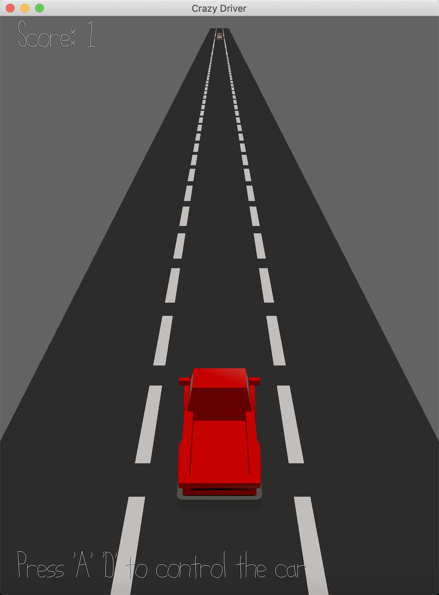

# (TODO: your game's title)

Author: (TODO: your name)

Design: (TODO: In two sentences or fewer, describe what is new and interesting about your game.)

Screen Shot:

How To Play:

(TODO: describe the controls and (if needed) goals/strategy.)

Sources: (TODO: list a source URL for any assets you did not create yourself. Make sure you have a license for the asset.)

* C++ Library: https://github.com/effolkronium/random . Author: effolkronium.
* Background music: Patron Saint of Heists. Author: Bryan Teoh. URL: https://freepd.com/scoring.php

This game was built with [NEST](NEST.md).

# Resource

Sound effect:
- Thunder: http://soundbible.com/2053-Thunder-Sound-FX.html